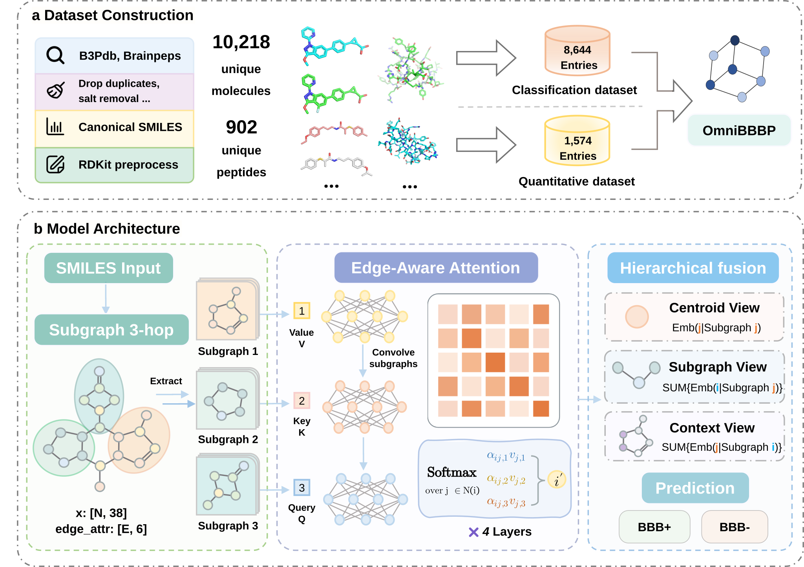

# BBBP-Atlas

BBBP-Atlas predicts blood–brain barrier permeability for small molecules and peptides using atom- and bond-level molecular graphs. **OmniBBBP** contains 10,218 records: 9,316 small molecules and 902 peptides. Peptides are supplied as explicit molecular structures rather than FASTA strings.



[Web platform](https://cadd.drugflow.com/bbbp/) · [Data splits](docs/DATA_SPLITTING.md) · [Checkpoints](ckpt/)

## Repository structure

| Directory or file | Contents |

|---|---|

| [dataset/](dataset/) | Classification datasets and quantitative BBB records |

| [splits/](splits/) | Fixed random train, validation, and test sets |

| [docs/DATA_SPLITTING.md](docs/DATA_SPLITTING.md) | Split methods, sample counts, and source-file hashes |

| [ckpt/](ckpt/) | Model configurations and weights |

| [macro/](macro/) | Cross-modal training, evaluation, and inference utilities |

| [plat_model/](plat_model/) | Graph-model implementation |

| [scripts/](scripts/) | Original training script and split-generation code |

| [environment.yml](environment.yml) | Installation dependencies |


## Data and evaluation

The collection contains a 10,018-record development pool and a separate balanced holdout of 200 small molecules from the same integrated collection. Labels are `1 = BBB+` and `0 = BBB−`.

| Dataset | Files | Records |

|---|---|---:|

| Full small-molecule collection | [CSV](dataset/bbbp_small_molecule.csv) | 9,316 |

| Small-molecule development set | [JSON](dataset/bbbp_small_molecule.json) | 9,116 |

| Peptides | [CSV](dataset/bbbp_peptides.csv), [JSON](dataset/bbbp_peptide.json) | 902 |

| Balanced small-molecule holdout | [CSV](dataset/bbbp_benchmark.csv), [JSON](dataset/bbbp_benchmark.json) | 200 |


The small-molecule CSV includes the benchmark records, the development JSON excludes them. Use the released split files for the fixed random evaluations. Quantitative measurements are provided separately in [bbbp_quantitative.json](dataset/bbbp_quantitative.json).


| Evaluation | Split seed | Train / validation / test |

|---|---:|---|

| [Small-molecule random split](splits/small_seed88/) | 88 | 7,292 / 912 / 912 |

| [Mixed random split](splits/mixed_seed42/) | 42 | 8,014 / 1,002 / 1,002 |

| Cross-modal comparison | 42 | Small molecules: 7,292 / 912 / 912; peptides: 722 / 90 / 90 |


The two random splits use unstratified 8:1:1 partitioning. The cross-modal comparison uses a separate frozen peptide similarity-cluster split and model seeds 42–46. Its `fixed_split_manifest.csv` and `protocol.json` are required by the training workflow and are not included in the random-split directories. Figure 4 uses a separate design: five mixed holdouts of 200 records, with one model per split.

## Checkpoints


| File | Model seed | Checkpoint selection |

|---|---:|---|

| [small_split88.pt](ckpt/small_split88.pt) | 44 | Legacy small-molecule run; maximum test accuracy |

| [Unweighted_joint_split42.pt](ckpt/Unweighted_joint_split42.pt) | 42 | Minimum mean small-molecule and peptide validation loss |

| [Modality-macro_joint_split42.pt](ckpt/Modality-macro_joint_split42.pt) | 42 | Minimum mean small-molecule and peptide validation loss |


Each file contains `model_config` and `model_state_dict` for one trained model. Filename suffixes identify the split seed. The small-molecule run also used test accuracy for learning-rate scheduling; its internal-test result is therefore a test-selected result, not an untouched holdout estimate.

## Installation


```bash

git clone https://github.com/SHENXIN516/BBBP-Atlas.git

cd BBBP-Atlas

conda env create -f environment.yml

conda activate bbbp-atlas

python -m pip check

```

The environment targets Linux with CUDA-enabled PyTorch and PyG extensions. GPU execution requires a compatible NVIDIA driver.


## Training and inference
  
| Script in `macro/scripts/` | Purpose |

|---|---|

| `train_small_molecule_repro.py` | Small-molecule and mixed-model training core |

| `train_fixed_peptide_comparison.py` | Small-only, peptide-only, and joint comparisons |

| `train_cross_modal_completion.py` | Modality-macro training and evaluation |

| `predict.py` | Prediction from an exported release package |

| `verify_inference.py` | Comparison with stored predictions |

| `test_inference.py` | Input, metric, and loading utility tests |

The training scripts use `macro/` as their working root. Source CSV files are available in [LiBP/dataset](https://github.com/SHENXIN516/LiBP/tree/main/dataset). The core accepts `--data`; fixed-comparison preparation expects `training_samples2.csv`, `train_9.csv`, `train_scaffold.csv`, and `external_samples2.csv` under `macro/dataset/`. Preserve their row order and contents.
  

For the similarity-cluster experiment, pass the frozen workspace containing `fixed_split_manifest.csv` and `protocol.json` through `--source-workspace`. The generic `prepare` command creates a random peptide split, not the similarity-cluster split.


`predict.py` takes `--package-root` and requires a release package with `release_index.json`, `SHA256SUMS.txt`, model sources, and per-model weights and metadata. The standalone files in `ckpt/` do not supply that package structure.


Run the utility tests from the repository root:


```bash

python -m unittest discover -s macro/scripts -p 'test_inference.py' -v

```

The original `scripts/train_plat.py` has local data-path settings and test-based learning-rate scheduling. Use the `macro/` workflows for validation-selected cross-modal training.


## Citation and license


Please cite the BBBP-Atlas manuscript when using the data or code. Record the repository commit and checkpoint used in your analysis.

```bibtex
@article{BBBPAtlas2026,
  title={BBBP-Atlas: Unified Interpretable Modeling of BBB Permeability across Small Molecules and Peptides},
  author={Xin Shen, Qun Su, Hao Luo, Qiaolin Gou, Jingxuan Ge, Tingjun Hou, Jike Wang, Yu Kang},
  journal={Chinese Chemical Letters, Under Review},
  year={2026}
}
```

Code is released under the [MIT License](License). Third-party data and dependencies retain their respective licenses.
